# Team 1 : 키보드 시뮬레이터

김병헌 이본행 임혜림 (가나다 순)

배포: [pages.dev](https://keyboard-simulator.pages.dev/)

중간발표 자료: [노션](https://leebh.notion.site/team1-65d4c4cf81b840c7a1bb0a9d2edee915)

---


# Component Diagram(C4 Model)

```mermaid
%%{
  init: {
    'theme': 'base',
    'themeVariables': {
      'primaryColor': '#222222',
      'primaryTextColor': '#F2F2F2',
      'primaryBorderColor': '#283140',
      'lineColor': '#CC8899',
      'secondaryColor': '#283140',
      'tertiaryColor': '#F2F2F2'
    }
  }
}%%

flowchart LR

subgraph User[키보드_사러온_손님]
    direction LR
    h1[-Person-]:::type
    d1[키보드 시뮬레이터에서 원하는 키보드의 타자 소리를 미리 들어보고 싶은 유저]:::description
end
User:::person
User--키보드 시뮬레이터 메인 페이지에 접속-->AppPageComponent


subgraph axesHelper[axesHelper]
end
axesHelper:::externalModule

subgraph OrbitControlsComponent[OrbitControls Component]
end
OrbitControlsComponent:::externalModule

subgraph BoxComponent[Box Component]
end
BoxComponent:::externalModule

subgraph meshStandardMaterial[meshStandardMaterial]
end
meshStandardMaterial:::externalModule

subgraph extrudeGeometry[extrudeGeometry]
end
extrudeGeometry:::externalModule

subgraph extrudeGeometry[extrudeGeometry]
end
extrudeGeometry:::externalModule

subgraph bufferGeometry[bufferGeometry]
end
bufferGeometry:::externalModule

subgraph bufferAttribute[bufferAttribute]
end
bufferAttribute:::externalModule

subgraph planeGeometry[planeGeometry]
end
planeGeometry:::externalModule

subgraph canvasTexture[canvasTexture]
end
canvasTexture:::externalModule

subgraph ambientLight[ambientLight]
end
ambientLight:::externalModule

subgraph directionalLight[directionalLight]
end
directionalLight:::externalModule

subgraph WebApplication[Web Application]

  %% src/App.tsx
      subgraph AppPageComponent[App Page Component]
        direction LR
        d2[타이틀과 키보드용 캔버스, 텍스트 에디터를 포함하는 메인 페이지]:::description
  end
  AppPageComponent:::internalPageComponent
  AppPageComponent--Renders-->MsgComponent
  AppPageComponent--Renders-->ThreeFiberComponent
  AppPageComponent--Renders-->PanelComponent

  %% src/App.tsx
      subgraph MsgComponent[Msg Component]
        d3[팀명 노출]:::description
      end
  MsgComponent:::internalComponent

  %% src/components/ThreeFiber/ThreeFiber.tsx
      subgraph ThreeFiberComponent[ThreeFiber Component]
        d4[캔버스 컨테이너]:::description
      end
  ThreeFiberComponent:::internalComponent
  ThreeFiberComponent--Renders-->CanvasComponent

  %% src/components/Panel/index.tsx
      subgraph PanelComponent[Panel Component]
        d5[에디터용 패널]:::description
      end
  PanelComponent:::internalComponent
  PanelComponent--Renders-->OpenButtonComponent
  PanelComponent--Renders-->ItemsComponent

      %% src/components/Panel/index.tsx
          subgraph OpenButtonComponent[OpenButton Component]
          end
      OpenButtonComponent:::internalComponent

      %% src/components/Panel/Items.tsx
          subgraph ItemsComponent[Items Component]
          end
      ItemsComponent:::internalComponent
      ItemsComponent--Renders-->ItemComponent

          %% src/components/Panel/Items.tsx
              subgraph ItemComponent[Item Component]
              end
          ItemComponent:::internalComponent
          ItemComponent--Renders-->EditorComponent
          ItemComponent--Renders-->PlayButtonComponent

              %% src/components/Panel/Items.tsx
                  subgraph EditorComponent[Editor Component]
                  end
              EditorComponent:::internalComponent

              %% src/components/Panel/Items.tsx
                  subgraph PlayButtonComponent[PlayButton Component]
                  end
              PlayButtonComponent:::internalComponent


      %% src/components/ThreeFiber/ThreeFiber.tsx
          subgraph CanvasComponent[Canvas Component]
            d6[캔버스]:::description
          end
      CanvasComponent:::internalComponent
      CanvasComponent--Renders-->KeyboardComponent
      CanvasComponent--Renders-->LightsComponent

      %% src/components/Keyboard/index.tsx
          subgraph KeyboardComponent[Keyboard Component]
            d7[키보드]:::description
          end
      KeyboardComponent:::internalComponent
      KeyboardComponent--Renders-->KeyComponent
      KeyboardComponent--Renders-->BoardBottomComponent

      %% src/components/Lights/index.tsx
          subgraph LightsComponent[Lights Component]
            d8[조명]:::description
          end
      LightsComponent:::internalComponent

          %% src/components/Keyboard/Key/index.tsx
              subgraph KeyComponent[Key Component]
              end
          KeyComponent:::internalComponent
          KeyComponent--Renders-->KeyCapComponent
          KeyComponent--Renders-->KeyLegendComponent

          %% src/components/Keyboard/index.tsx
              subgraph BoardBottomComponent[BoardBottom Component]
                d12[키보드 밑판]:::description
              end
          BoardBottomComponent:::internalComponent

              %% src/components/Keyboard/Key/KeyCap.tsx
                  subgraph KeyCapComponent[KeyCap Component]
                  end
              KeyCapComponent:::internalComponent

              %% src/components/Keyboard/Key/KeyLegend.tsx
                  subgraph KeyLegendComponent[KeyLegend Component]
                  end
              KeyLegendComponent:::internalComponent

end

CanvasComponent--Uses-->axesHelper
CanvasComponent--Uses-->OrbitControlsComponent
KeyboardComponent--Uses-->BoxComponent
KeyboardComponent--Uses-->meshStandardMaterial
LightsComponent--Uses-->ambientLight
LightsComponent--Uses-->directionalLight
BoardBottomComponent--Uses-->extrudeGeometry
BoardBottomComponent--Uses-->meshStandardMaterial
KeyCapComponent--Uses-->bufferGeometry
KeyCapComponent--Uses-->bufferAttribute
KeyCapComponent--Uses-->meshStandardMaterial
KeyLegendComponent--Uses-->planeGeometry
KeyLegendComponent--Uses-->meshStandardMaterial
KeyLegendComponent--Uses-->canvasTexture

%% Element type definitions

classDef person fill:#222222,stroke:#222222,stroke-width:4px,color:#F2F2F2,font-size:18px;
classDef internalPageComponent fill:#8ADBFC,stroke:#8ADBFC,stroke-width:4px,color:#222222,font-size:18px;
classDef internalComponent fill:#08427b,stroke:#08427b,stroke-width:4px,color:#F2F2F2,font-size:18px;
classDef externalModule fill:#08427b,stroke:#08427b,stroke-width:4px,color:#F2F2F2,font-size:18px;
```



# 구현 내용


https://user-images.githubusercontent.com/9066602/221558192-b59fa237-1a46-4345-8d2f-9e9e388810be.MP4


구현 항목은 다음과 같습니다.
1. 키 캡 만들기
2. 키보드 만들기
3. 텍스트 입력 패널
4. 텍스트 이벤트 발생 로직
5. 이벤트에 따라 키보드 애니메이션


## 1. 키 캡

https://github.com/Febase/febase4-3d-team1/pull/3

### 1-1. 키 캡 모양
키캡은 윗면이 팔각형이고, 밑면이 사각형인 기둥모양으로 되어있습니다.

해당 모양을 여러 개의 삼각형으로 만든 후, 각 삼각형의 좌표들을 배열에 담아 bufferGeometry를 만듭니다. 


### 1-2. 키 캡 각인
각인은 PlaneGeometry(평면)을 만들어 키 캡의 윗면과 평행하도록 회전 및 위치시킵니다.

이 때, 키 캡 윗면과 z-fighting이 일어날 수 있으므로, polygonOffset과 polygonOffsetFactor를 지정해줍니다.

각인의 글자는 canvas 요소를 생성하여 canvas에 글자를 넣은 후, 텍스쳐로 만들어 적용합니다.


### 1-3. 키 캡 조명


3가지 조명이 적용되었습니다. 전체를 비추는 ambientLight 하나와 directionalLight 두 개입니다.

directionalLight는 입체감을 위해 앞쪽에서 키보드 방향으로는 밝은 색 조명, 뒤에서 키보드 방향으로는 어두운 색 조명을 넣어주었습니다.

```
<bufferGeometry
  attach="geometry"
  onUpdate={(self) => self.computeVertexNormals()}
>
```
조명이 적용되려면 geometry에 법선(normal)이 존재해야하므로 위와 같이 computeVertexNormals를 적용해야합니다.

## 2. 키보드

https://github.com/Febase/febase4-3d-team1/pull/3 https://github.com/Febase/febase4-3d-team1/pull/10


### 2-1. 키 캡 배치
```
const keyConfigs = [
  {
    row: 0,
    column: 0,
    rowSpan: 1,
    colSpan: 1,
    color: '#6096B4',
    legend: { text: 'A', color: '#93BFCF' },
  },
  {
    row: 0,
    column: 1,
    rowSpan: 1,
    colSpan: 1,
    color: '#F0EEED',
    legend: { text: 'S', color: '#332C39' },
  }
]
```
키 캡은 마치 테이블처럼 row, column, rowSpan, columnSpan 값을 이용하여 배치할 수 있도록 구성하였습니다.

키 캡들을 배치한 뒤, 이들을 하나의 그룹으로 묶어 하나의 단위로 구성하였습니다.


### 2-2. 키보드 밑판


키보드 밑판은 직각삼각형 기둥과 직육면체를 합쳐 구성하였습니다.

직각 삼각형 기둥은 2차원 직각삼각형을 만든 후, extrudeGeometry를 이용하여 3차원 기둥으로 확장하였습니다.

직각삼각형은 작은 각이 30도 이므로 키 캡 그룹을 30도 회전시켜 직각삼각형의 빗변에 위치시켰습니다.


## 3. 텍스트 입력 패널


https://github.com/Febase/febase4-3d-team1/pull/9

## 4. 이벤트에 따라 키보드 애니메이션
`Document`에 이벤트를 발생시켜서 ThreeJS에서 그걸 읽으려고 했습니다.

```ts
export type ThreeEventType = {
  keyId?: string
}

interface ThreeCustomEvent {
  threekeyboardevent: CustomEvent<ThreeEventType>
}
declare global {
  interface Document {
    //adds definition to Document, but you can do the same with HTMLElement
    addEventListener<K extends keyof ThreeCustomEvent>(
      type: K,
      listener: (this: Document, ev: ThreeCustomEvent[K]) => void,
    ): void
    removeEventListener<K extends keyof ThreeCustomEvent>(
      type: K,
      listener: (this: Document, ev: ThreeCustomEvent[K]) => void,
    ): void
    dispatchEvent<K extends keyof ThreeCustomEvent>(
      ev: ThreeCustomEvent[K],
    ): void
  }
}
export {}

```

덕분에 아래처럼 호출해서 쓸 수 있습니다.

```ts
document.addEventListener('keydown', (evt) => {
  const event = genCustomKeyEventFromCharacter(evt.key)
  document.dispatchEvent(event)
})
```

https://github.com/Febase/febase4-3d-team1/pull/6


## 5. 키보드 입력 실행
`usePlayText` 훅을 만들어서 사용했습니다.
```ts
    const textArray = text.split('')
    const id = setInterval(() => {
      const keyId = textArray[index].toLowerCase()
      const event = new CustomEvent('threekeyboardevent', {
        detail: {
          keyId,
        },
      })
      document.dispatchEvent(event)
```

https://github.com/Febase/febase4-3d-team1/pull/8 


